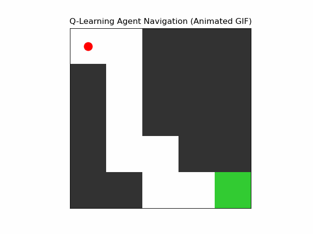

# Q-Learning Grid World Simulation

This repository contains a simple yet illustrative implementation of **Q-Learning**, a reinforcement learning algorithm, to train an agent to navigate a 2D grid world with obstacles and reach a goal.

## 📌 Overview

- **Environment**: 5x5 Grid World  
- **Start Position**: Top-left `(0, 0)`  
- **Goal**: Bottom-right `(4, 4)`  
- **Obstacles**: Configurable cells the agent must avoid  
- **Algorithm**: Model-free Q-Learning  
- **Visualization**: Animated GIF showing the agent's learned path  

## 🧠 Key Concepts

- **Reinforcement Learning**: An agent interacts with an environment and learns optimal behavior by maximizing cumulative rewards.
- **Q-Learning**: A value-based off-policy RL algorithm that learns the expected utility of action-state pairs using the Bellman Equation.

## ⚙️ How It Works

1. Define the environment with states, actions, obstacles, and rewards.
2. Initialize the Q-table with zeros.
3. Train the agent over multiple episodes:
   - Use ε-greedy strategy for exploration vs. exploitation.
   - Update Q-values using:
     ```
     Q(s, a) ← Q(s, a) + α * [r + γ * max Q(s', a') - Q(s, a)]
     ```
4. Extract the best policy from the Q-table.
5. Generate an animated GIF of the agent navigating the grid.

## 📽 Output

The project generates a file named `q_learning_agent.gif` showing the agent following the optimal path from start to goal while avoiding obstacles.

## 📦 Requirements

- Python 3.x
- NumPy
- Matplotlib
- Pillow (for saving the GIF)

Install dependencies using:

```bash
pip install numpy matplotlib pillow
```
## 🚀 Run the Code
```
python RL_Maze.ipynb
```
Make sure to run in an environment that supports saving GIFs (e.g., local machine or Jupyter Notebook with pillow installed).

## 🏁 Sample Output



## 📚 License
This project is open source and available under the MIT License.
